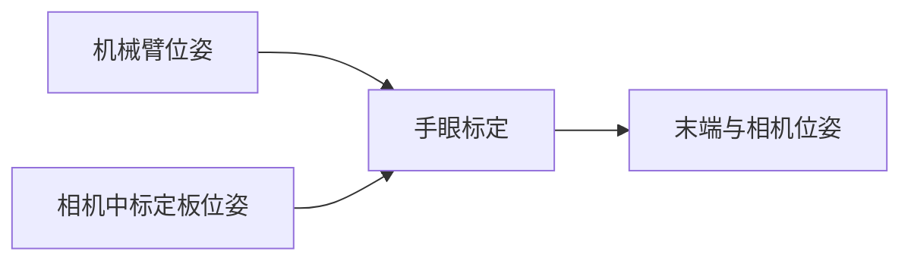

# 基于ROS的手眼标定程序包
## 概览
- 如果教程对你有帮助，可以start一下~
- 包含基础标定程序包，提供多组机器臂工具坐标和Marker坐标即可完成标定
- 包含JAKA、AUBO机械臂标定程序
- 本程序在`ros kinetic melodic`平台测试通过

>本程序包目前仅针对眼在手上的标定，通过输入两组以上的机械臂姿态信息(x,y,z,rx,ry,rz)和装在机械手上的相机所识别的标志物的姿态信息，经过程序计算可输出，机械臂末端和相机之间的坐标变换矩阵。



## 使用指南
### 1、基础使用
基础使用是在得到多组机械臂位姿与机械臂末端相机位姿之后直接使用本程序进行计算机械臂末端与相机之间的位姿关系。

- 机械臂位姿可以通过示教器或者SDK进行获取
  
- 相机中标定板位姿我们可以通过ArUco或者ArTookit等工具获得，可以参考这里。

> 我们使用一般读到的`（X,Y,Z,RX,RY,RZ）`六个数据表示

#### 安装测试


1. 下载编译
    ```
    git clone http://10.55.16.230/sangxin/handeye-calib.git
    cd handeye-calib
    catkin_make or catkin build
    ```
    
2. 修改base_hand_on_eye_calib.launch文件中，base_handeye_data参数为从机械臂位姿和标定板位姿所在的配置文件所在的绝对目录,可以使用launch文件的`find`。
    ```
    <launch>
      <!-- <arg   name="base_handeye_data"   default="The file path of handeye data." /> -->
      <arg   name="base_handeye_data"   default="$(find handeye-calib)/config/base_hand_on_eye_test_data.csv" />
      <node pkg="handeye-calib" type="base_hand_on_eye_calib.py" name="base_hand_on_eye_calib" output="screen" >
          <param name="base_handeye_data" value="$(arg base_handeye_data)" />
      </node>
    </launch>
    ```
    
3. 运行程序
    ```
    source devel/setup.bash
    roslaunch handeye-calib base_hand_on_eye_calib.launch
    ```

4. 查看结果
    程序会根据配置文件中的坐标进行计算，最终输出如下数据(单位毫米，弧度制)：
    
    数据包含不同算法下计算结果，以及计算结果的标准差和方差等数据。
    
    ```
    algoritihms            x            y           z         rx          ry       rz    distance
    -------------  ---------  -----------  ----------  ---------  ----------  -------  ----------
    Daniilidis     0.0254407  -0.00388589  0.00626286  -1.34278   -0.0699976  91.0318   0.0264868
    Horaud         0.035229   -0.0151477   0.0185151    1.65751    0.943546   89.7013   0.0425833
    Park           0.0352315  -0.0151497   0.0185238    1.65744    0.944041   89.6995   0.04259
    Tsai-Lenz      0.0514184  -0.0291956   0.0236991    0.958984   1.89297    89.4352   0.0637015
    name              x             y            z       rx        ry         rz     distance
    ------  -----------  ------------  -----------  -------  --------  ---------  -----------
    mean    0.0368299    -0.0158447    0.0167502    0.73279  0.927639  89.9669    0.0438404
    var     8.69144e-05   8.05572e-05  4.11328e-05  1.51731  0.481914   0.389663  0.000174689
    std     0.00932279    0.00897536   0.00641349   1.23179  0.6942     0.62423   0.013217
    
    Daniilidis              x             y             z           rx           ry           rz     distance
    ------------  -----------  ------------  ------------  -----------  -----------  -----------  -----------
    point0        1.12994      -0.261557     -0.303544     1.56839      0.0486538    3.02918      1.19888
    point1        1.12386      -0.256959     -0.307001     1.55079      0.0350867    3.02347      1.19303
    point2        1.12649      -0.256307     -0.306266     1.55284      0.0356765    3.02361      1.19519
    point3        1.12565      -0.253896     -0.307797     1.555        0.0263091    3.02058      1.19427
    point4        1.13011      -0.250703     -0.3061       1.55657      0.046811     3.01531      1.19737
    mean          1.12721      -0.255884     -0.306142     1.55672      0.0385074    3.02243      1.19575
    var           6.00994e-06   1.28613e-05   2.04871e-06  3.78781e-05  6.80825e-05  2.04147e-05  4.45839e-06
    std           0.00245152    0.00358626    0.00143133   0.00615452   0.00825121   0.00451826   0.00211149
    
    Horaud              x             y             z           rx            ry           rz     distance
    --------  -----------  ------------  ------------  -----------  ------------  -----------  -----------
    point0    1.08483      -0.262978     -0.318057     1.55897      -0.00705108   3.0495       1.16068
    point1    1.08404      -0.255567     -0.323067     1.53871      -0.0174223    3.05         1.15967
    point2    1.09116      -0.257748     -0.322579     1.5435       -0.0165301    3.05181      1.16667
    point3    1.09252      -0.254445     -0.32486      1.54551      -0.0238963    3.05223      1.16785
    point4    1.08396      -0.25189      -0.316132     1.54735      -0.00344446   3.04677      1.15687
    mean      1.0873       -0.256525     -0.320939     1.54681      -0.0136688    3.05006      1.16235
    var       1.39945e-05   1.39716e-05   1.08019e-05  4.53041e-05   5.50417e-05  3.77804e-06  1.77698e-05
    std       0.00374092    0.00373786    0.00328662   0.00673083    0.00741901   0.00194372   0.00421543
    
    Park              x             y             z          rx            ry          rz     distance
    ------  -----------  ------------  ------------  ----------  ------------  ----------  -----------
    point0  1.08483      -0.262981     -0.318067     1.55897     -0.00705403   3.04953     1.16068
    point1  1.08405      -0.255566     -0.323077     1.5387      -0.0174209    3.05003     1.15968
    point2  1.09117      -0.25775      -0.322589     1.5435      -0.0165283    3.05184     1.16668
    point3  1.09253      -0.254446     -0.32487      1.54551     -0.0238923    3.05226     1.16786
    point4  1.08396      -0.251893     -0.316141     1.54735     -0.00344051   3.0468      1.15687
    mean    1.08731      -0.256527     -0.320949     1.54681     -0.0136672    3.05009     1.16236
    var     1.40185e-05   1.39759e-05   1.08042e-05  4.5316e-05   5.50296e-05  3.7782e-06  1.78012e-05
    std     0.00374414    0.00373844    0.00328697   0.00673172   0.0074182    0.00194376  0.00421915
    
    Tsai-Lenz              x             y            z           rx            ry           rz     distance
    -----------  -----------  ------------  -----------  -----------  ------------  -----------  -----------
    point0       1.08118      -0.26596      -0.329331    1.5432        0.00335281   3.05875      1.1611
    point1       1.07916      -0.25742      -0.334988    1.52213      -0.00593988   3.05615      1.15891
    point2       1.08686      -0.260925     -0.335914    1.52765      -0.00494656   3.05948      1.16712
    point3       1.08833      -0.256919     -0.339045    1.52961      -0.0118364    3.05914      1.16851
    point4       1.07685      -0.254707     -0.324463    1.53139       0.00852579   3.05335      1.15315
    mean         1.08247      -0.259186     -0.332748    1.5308       -0.00216884   3.05737      1.16176
    var          1.95647e-05   1.54478e-05   2.7001e-05  4.81123e-05   5.20523e-05  5.42287e-06  3.14201e-05
    std          0.0044232     0.00393036    0.00519625  0.0069363     0.00721473   0.0023287    0.00560536
    ```

### 2、结合JAKA机械臂使用
- **jaka标定文件会自己订阅两个话题的数据**，一个是机械臂的位姿话题和相机中标定物的位姿话题。
- 机械臂的话题可以通过运行本仓库中的jaka_comuniate功能包中的jaka_comuniate.launch获得。
- 相机中标记物的姿态数据，可以参考本文第四节使用ArUco获取标定板位姿

#### 1.配置jaka机械臂ip地址信息

配置jaka_host参数为你的jaka机械臂所在的host，并确保你目前所使用的电脑能够`ping`通该ip。

运行该节点后将会发布`jaka_pose`话题并运行

```
<launch>
    <arg  name="jaka_host"   default="10.55.17.17" />
    <node pkg="jaka_comuniate" type="jaka_comuniate" name="jaka_comuniate" output="screen" >
         <param name="jaka_host" value="$(arg jaka_host)" />
    </node>
</launch>
```

运行节点

```
source devel/setup.bash
roslaunch jaka_comuniate jaka_comuniate.launch 
```
#### 2.运行标定板识别程序
  请参考第四节（4.使用系统ArUco获取标定板位姿）

#### 3.配置话题信息
主要配置参数有`jaka_pose_topic`、`camera_pose_topic`。分别代表jaka机械臂的通信地址和，相机中标记物的位姿话题。
  ```
  <launch>
    <!-- The arm tool Pose Topic,Use ros geometry_msgs::Pose-->
    <arg   name="jaka_pose_topic"   default="/jaka_pose" />
    <!-- The arm marker in camera Pose Topic,Use ros geometry_msgs::Pose-->
    <arg   name="camera_pose_topic"   default="/ar_pose_estimate/marker_to_camera" />

    <node pkg="handeye-calib" type="jaka_hand_on_eye_calib.py" name="jaka_hand_on_eye_calib" output="screen" >
         <param name="jaka_pose_topic" value="$(arg jaka_pose_topic)" />
         <param name="camera_pose_topic" value="$(arg camera_pose_topic)" />
    </node>
    
</launch>
  ```

#### 3.运行标定程序

```
source devel/setup.bash
roslaunch handeye-calib jaka_hand_on_eye_calib.launch
```

#### 4.开始标定
程序运行是会对话题数据进行检测，先检测是否收到机械臂数据，如果没有会一直等待。
当检测到已经接收到数据之后，就会出现，命令提示。
命令定义如下：
```
r  rocord    记录一组手眼数据（当记录的数据大于程序计算所需的数据量之后会进行自动计算）
c  calculate 计算当前数据
s  save      保存数据
p  print     打印当前数据到屏幕上（格式为 type,x,y,z,rx,ry,rz 角度制）
q  quit      退出标定程序
```
```
[INFO] [1612856654.307437]: Get topic from param server: jaka_pose_topic:/jaka_pose camera_pose_topic:/aruco_single/pose
[INFO] [1612856655.311045]: Waiting jaka pose topic data ...
[INFO] [1612856656.313039]: Waiting jaka pose topic data ...
[INFO] [1612856657.314364]: Waiting jaka pose topic data ...
input:  r     record,c    calculate,s     save,q    quit:
```
拖拽机械臂或者用视校器移动机械臂，但要保证相机事业中依然可以看到标定板。
输入`r`记录一组手眼数据。

#### 5.生成参数
完成标定之后输入`s`即可进行保存，将保存标定结果数据和计算所使用的数据。

##### 标定结果正确与否的测试
观察数据计算结果的标准差大小。
   每次计算之后，程序都会输出不同算法下标定结果点的平均数、方差、标准差三项数值。

   > 由于标定过程中标定板是没有发生移动的，所以我们通过机械臂的末端位置、标定结果（手眼矩阵）、标记物在相机中的位姿即可计算出标定板在机器人基坐标系下的位姿，如果标定结果准确该位姿应该是没有变化的。

   可以比较最终数据的波动情况来判定标定结果的好坏。

比如：

标定板在机械臂基坐标系的位置1：
```
Tsai-Lenz               x            y             z            rx            ry           rz     distance
-----------  ------------  -----------  ------------  ------------  ------------  -----------  -----------
point0       -0.45432      0.0488783     0.000316595   0.0420852    -0.0245641    1.52064      0.456941
point1       -0.457722     0.054523      0.0121959    -0.0266793     0.0050922    1.53391      0.461119
point2       -0.457198     0.0535639     0.00246136    0.0252805    -0.0329136    1.51927      0.460331
point3       -0.453302     0.0618366     0.00165179    0.0405718    -0.0472311    1.53318      0.457503
point4       -0.455802     0.0589413     0.000377679   0.0222521    -0.0360589    1.51963      0.459598
point5       -0.455392     0.0615103     0.00584822    0.0365886    -0.033448     1.50684      0.459565
point6       -0.451144     0.0571198     0.00498852    0.0618337    -0.0170326    1.52463      0.454773
point7       -0.452829     0.0588266    -0.000827528   0.0324858    -0.0292652    1.52268      0.456635
point8       -0.454238     0.063634      0.00488078    0.0411648    -0.0373725    1.51611      0.458699
point9       -0.453579     0.0631788     0.00390939    0.0339742    -0.0645821    1.53168      0.457974
point10      -0.454952     0.066057     -0.00144969    0.0399135     0.0029201    1.5053       0.459725
point11      -0.459518     0.0553877    -0.00209946    0.0450864    -0.0147387    1.50702      0.462848
point12      -0.454928     0.0590754    -0.0045181     0.0297534    -0.0296122    1.52043      0.45877
point13      -0.455234     0.0527075    -0.00389213    0.0358822    -0.0260668    1.51244      0.458292
mean         -0.455011     0.0582314     0.0017031     0.0328709    -0.027491     1.51955      0.45877
var           4.21677e-06  2.16484e-05   1.84365e-05   0.000357231   0.000305579  8.29112e-05  3.79771e-06
std           0.00205348   0.00465279    0.00429378    0.0189005     0.0174808    0.00910556   0.00194877
```
标定板在机械臂基坐标系的位置2：
```
Tsai-Lenz              x            y            z           rx            ry           rz     distance
-----------  -----------  -----------  -----------  -----------  ------------  -----------  -----------
point0       -0.428394    0.052448     0.0353171    0.0259549    -0.0541487    1.57929      0.433035
point1       -0.427841    0.0448442    0.0345359    0.0454481    -0.0371304    1.55639      0.431569
point2       -0.424889    0.0486165    0.0278942    0.0455775    -0.0438353    1.57073      0.42857
point3       -0.421985    0.0485442    0.0311218    0.0138094    -0.0307286    1.55606      0.425906
point4       -0.428353    0.0454091    0.0326252    0.039192     -0.0492181    1.59177      0.431987
point5       -0.432111    0.0458869    0.0359774    0.04632      -0.0383476    1.55942      0.436028
mean         -0.427262    0.0476248    0.0329119    0.0360503    -0.0422348    1.56894      0.431183
var           9.9672e-06  6.79218e-06  7.71397e-06  0.000148499   6.11379e-05  0.000174299  1.03945e-05
std           0.00315709  0.00260618   0.0027774    0.012186      0.00781908   0.0132022    0.00322405
```

我们可以观察两次标定结果的距离的标准差，第一次的标准差小于的第二次的标准差，这表示第一次的标定结果好于第二次。
> 标准差越小，数据越聚集。

### 3、结合AUBO机械臂使用

- 使用AUBO机械臂标定需要来自两个话题的信息，一个是机械臂的姿态话题，一个是相机中标定板的位姿话题

- 安装所需文件

  ​	1.安装aubo python sdk

  ```
  cd src/aubo_comuniate/lib/libpy3auboi5-v1.2.3.x64
  ./install.sh
  ```

  ​	2.安装python3 rospkg

  ```
  pip3 install rospkg
  ```

#### 1.配置aubo机械臂ip地址信息

```
cd src/aubo_comuniate/launch/
```

修改aubo_comuniate.launch的aubo_host为aubo机械臂所在的IP地址：

```xml
<launch>
    <arg  name="aubo_host"   default="10.55.130.223" />
    <node pkg="aubo_comuniate"  name="aubo_comuniate"  type="aubo_comuniate_py_3.py" output="screen" >
         <param name="aubo_host" value="$(arg aubo_host)" />
    </node>
</launch>
```

#### 2.运行aubo通信节点

```shell
source devel/setup.bash
roslaunch aubo_comuniate aubo_comuniate.launch
```

#### 3.运行标定板识别程序

  请参考第四节（4.使用系统ArUco获取标定板位姿）
#### 4.配置标定所需话题
主要配置参数有`aubo_pose_topic`、`camera_pose_topic`。分别代表aubo机械臂的通信话题和相机中标记物的位姿话题。
> 通过这两个话题我们就可以拿到机械臂和标志物在相机中的位姿信息.
```shell
cd src/handeye-calib/launch
修改 aubo_hand_on_eye_calib.launch
```
```xml
<launch>
    <!-- The arm tool Pose Topic,Use ros geometry_msgs::Pose-->
    <arg   name="aubo_pose_topic"   default="/aubo_pose" />

    <!-- The arm marker in camera Pose Topic,Use ros geometry_msgs::Pose-->
    <arg   name="camera_pose_topic"   default="/aruco_single/pose" />

    <!-- <arg   name="camera_pose_topic"   default="/ar_pose_estimate/marker_to_camera" /> -->
    <node pkg="handeye-calib" type="aubo_hand_on_eye_calib.py" name="aubo_hand_on_eye_calib" output="screen" >
         <param name="aubo_pose_topic" value="$(arg aubo_pose_topic)" />
         <param name="camera_pose_topic" value="$(arg camera_pose_topic)" />
    </node>

</launch>
```

#### 5.运行标定程序

```
 source devel/setup.bash
 roslaunch handeye-calib aubo_hand_on_eye_calib.launch
```

#### 6.开始标定

程序运行是会对话题数据进行检测，先检测是否收到机械臂数据，如果没有会一直等待。
当检测到已经接收到数据之后，就会出现，命令提示。
命令定义如下：

```
r  rocord    记录一组手眼数据（当记录的数据大于程序计算所需的数据量之后会进行自动计算）
c  calculate 计算当前数据
s  save      保存数据
p  print     打印当前数据到屏幕上（格式为 type,x,y,z,rx,ry,rz 角度制）
q  quit      退出标定程序
```

```
[INFO] [1612856654.307437]: Get topic from param server: jaka_pose_topic:/jaka_pose camera_pose_topic:/aruco_single/pose
[INFO] [1612856655.311045]: Waiting jaka pose topic data ...
[INFO] [1612856656.313039]: Waiting jaka pose topic data ...
[INFO] [1612856657.314364]: Waiting jaka pose topic data ...
input:  r     record,c    calculate,s     save,q    quit:
```

拖拽机械臂或者用视校器移动机械臂，但要保证相机事业中依然可以看到标定板。
输入`r`记录一组手眼数据。

#### 7.生成参数

完成标定之后输入`s`即可进行保存，将保存标定结果数据和计算所使用的数据。

#### 8.标定结果正确与否的测试

观察数据计算结果的标准差大小。
   每次计算之后，程序都会输出不同算法下标定结果点的平均数、方差、标准差三项数值。

   > 由于标定过程中标定板是没有发生移动的，所以我们通过机械臂的末端位置、标定结果（手眼矩阵）、标记物在相机中的位姿即可计算出标定板在机器人基坐标系下的位姿，如果标定结果准确该位姿应该是没有变化的。

   可以比较最终数据的波动情况来判定标定结果的好坏。

比如：

标定板在机械臂基坐标系的位置1：

```
Tsai-Lenz               x            y             z            rx            ry           rz     distance
-----------  ------------  -----------  ------------  ------------  ------------  -----------  -----------
point0       -0.45432      0.0488783     0.000316595   0.0420852    -0.0245641    1.52064      0.456941
point1       -0.457722     0.054523      0.0121959    -0.0266793     0.0050922    1.53391      0.461119
point2       -0.457198     0.0535639     0.00246136    0.0252805    -0.0329136    1.51927      0.460331
point3       -0.453302     0.0618366     0.00165179    0.0405718    -0.0472311    1.53318      0.457503
point4       -0.455802     0.0589413     0.000377679   0.0222521    -0.0360589    1.51963      0.459598
point5       -0.455392     0.0615103     0.00584822    0.0365886    -0.033448     1.50684      0.459565
point6       -0.451144     0.0571198     0.00498852    0.0618337    -0.0170326    1.52463      0.454773
point7       -0.452829     0.0588266    -0.000827528   0.0324858    -0.0292652    1.52268      0.456635
point8       -0.454238     0.063634      0.00488078    0.0411648    -0.0373725    1.51611      0.458699
point9       -0.453579     0.0631788     0.00390939    0.0339742    -0.0645821    1.53168      0.457974
point10      -0.454952     0.066057     -0.00144969    0.0399135     0.0029201    1.5053       0.459725
point11      -0.459518     0.0553877    -0.00209946    0.0450864    -0.0147387    1.50702      0.462848
point12      -0.454928     0.0590754    -0.0045181     0.0297534    -0.0296122    1.52043      0.45877
point13      -0.455234     0.0527075    -0.00389213    0.0358822    -0.0260668    1.51244      0.458292
mean         -0.455011     0.0582314     0.0017031     0.0328709    -0.027491     1.51955      0.45877
var           4.21677e-06  2.16484e-05   1.84365e-05   0.000357231   0.000305579  8.29112e-05  3.79771e-06
std           0.00205348   0.00465279    0.00429378    0.0189005     0.0174808    0.00910556   0.00194877
```

标定板在机械臂基坐标系的位置2：

```
Tsai-Lenz              x            y            z           rx            ry           rz     distance
-----------  -----------  -----------  -----------  -----------  ------------  -----------  -----------
point0       -0.428394    0.052448     0.0353171    0.0259549    -0.0541487    1.57929      0.433035
point1       -0.427841    0.0448442    0.0345359    0.0454481    -0.0371304    1.55639      0.431569
point2       -0.424889    0.0486165    0.0278942    0.0455775    -0.0438353    1.57073      0.42857
point3       -0.421985    0.0485442    0.0311218    0.0138094    -0.0307286    1.55606      0.425906
point4       -0.428353    0.0454091    0.0326252    0.039192     -0.0492181    1.59177      0.431987
point5       -0.432111    0.0458869    0.0359774    0.04632      -0.0383476    1.55942      0.436028
mean         -0.427262    0.0476248    0.0329119    0.0360503    -0.0422348    1.56894      0.431183
var           9.9672e-06  6.79218e-06  7.71397e-06  0.000148499   6.11379e-05  0.000174299  1.03945e-05
std           0.00315709  0.00260618   0.0027774    0.012186      0.00781908   0.0132022    0.00322405
```

我们可以观察两次标定结果的距离的标准差，第一次的标准差小于的第二次的标准差，这表示第一次的标定结果好于第二次。

> 标准差越小，数据越聚集。


### 4、使用系统ArUco获取标定板位姿
- 在线生成标定板:https://chev.me/arucogen/

#### 1.安装
  Kinetic：
  ```
  sudo apt-get install ros-kinetic-aruco*
  ```
  Melodic：
  ```
  sudo apt-get install ros-melodic-aruco*
  ```
  其他版本

  ```
  sudo apt-get install ros-版本名称-aruco*
  ```

#### 2.修改参数
可以直接使用本仓库中handeye-calib所提供的`aruco_start_usb_cam.launch`或者`aruco_start_realsense_sdk.launch` 分别使用realsense和usb相机的驱动来运行，这个视你的相机而定。

需要修改的参数如下：

- camera_info_url 相机标定文件所在位置
- video_device： 设备位置
- image_width： 图片宽度
- image_height： 图片高度
- markerId： 标定板编号，就是你所用的标定板的id，可以通过`在线生成标定板:https://chev.me/arucogen/`进行生成并打印
- markerSize：标定板的宽度 单位m
```

<arg name="camera_info_url"  default="file:///home/dev/.ros/camera_info/ost.yaml"/>
<arg name="video_device"     default="/dev/video2"/>
<arg name="image_width"      default="1280"/>
<arg name="image_height"     default="720"/>

<arg name="markerId"        default="0"/>
<arg name="markerSize"      default="0.151"/>    
```

#### 3.开始运行

```
source devel/setup.bash
roslaunch handeye-calib aruco_start_usb_cam.launch
```


## 其他
### 1.、使用ROS usb_cam驱动相机：
- 目前暂不支持网络相机，后面将考虑纳入该相机驱动。
  
#### a.安装usbcam
Kinetic：
```
sudo apt-get install ros-kinetic-usb-cam
```
Melodic：
```
sudo apt-get install ros-melodic-usb-cam
```
其他版本

```
sudo apt-get install ros-melodic-版本名称-cam
```

#### b.修改launch文件

进入目录：
```
roscd usb_cam
cd launch
sudo gedit usb_cam-test.launch 
```
目前主要修改device和width两个参数，可以使用`ls /dev/video*`查看系统视频设备。
```
<launch>
  <node name="usb_cam" pkg="usb_cam" type="usb_cam_node" output="screen" >
    <!-- modify the video device to your device -->
    <param name="video_device" value="/dev/video2" />
    <!-- modify the size of your device -->
    <param name="image_width" value="1280" />
    <param name="image_height" value="720" />
    <param name="pixel_format" value="yuyv" />
    <param name="camera_frame_id" value="usb_cam" />
    <param name="io_method" value="mmap"/>
  </node>
  <node name="image_view" pkg="image_view" type="image_view" respawn="false" ou$
    <remap from="image" to="/usb_cam/image_raw"/>
    <param name="autosize" value="true" />
  </node>
</launch>
```
#### c. 启动相机

```
roslaunch usb_cam usb_cam-test.launch
```

### 2、使用ROS进行相机标定
#### 1.使用ROS自带的标定程序进行标定。

- 小工具：棋盘格pdf在线生成网站：[点击打开](https://calib.io/pages/camera-calibration-pattern-generator),生成后使用一比一打印要比手动量的要精准哦。
- 标定完成后点击Save可以保存标定所用的图片和参数矩阵。在终端里会输出标定产生的压缩包，默认放在`/tmp`目录下。

##### a.运行标定程序

运行前需要根据你的棋盘格修改两个参数，一个是size参数为棋盘格角点数量比如8x9=72个格子的棋盘格，角点个数为7x8=63个，size参数就要写7x8。另外一个参数为square，传入的参数为棋盘格一个小格子的宽度（注意单位为m）。
```
rosrun camera_calibration cameracalibrator.py --size 10x7 --square 0.015 image:=/usb_cam/image_raw camera:=/usb_cam
```
##### b.生成标定文件  
标定完成后点击Calculate会稍微有点卡顿，不要担心后台正在进行标定，完成后下面的SAVE和COMMIT按钮变为可用状态，点击SAVE即可保存标定完成后的文件。

##### c.在ROS中使用该参数
可以在usb_cam的launch文件中增加以下参数，重新启动usb_cam节点，即可使用该标定参数。

```
<param name="camera_info_url" type="string" value="file:///home/dev/.ros/camera_info/ost.yaml"/>
```

## 版本日志
- V2.1
  添加USBCAM，CALIBRATE内容。

- V2.1
  添加Aruco 启动文件。

- V2.0
  添加配合aubo机械臂进行手眼标定程序。

- V1.5
  添加配合jaka机械臂进行手眼标定程序。

- V1.0
  完成基础标定程序包，可以通过文件输出位姿进行，输出标定结果。并进行校验。

## 贡献

- [@sangxin](sangxin@infore.com) InforeRobot

## 参考
- easy-handeye
- opencv-calibHandEye
- jaka&&aubo
- aruco_ros
- [csdn](https://blog.csdn.net/sandy_wym_/article/details/83996479)